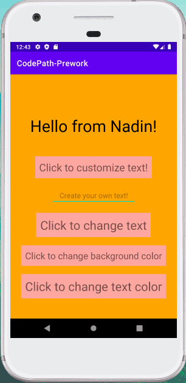

## "Hello World!" Android App (CodePath Android Pre-Work) ✨

### App Description
This is my first ever Android app, completed with guidance from CodePath tutorials. The app has several different elements that allow the user to interact with the user interface, including: a button that changes the text of the label, a button that changes the app's background color, a button that changes the text color, and a text field & button that allow the user to set a custom string for the label text. The user can also tap on the background view to reset all the views to their default settings. 

### App Walk-through

### Required User Stories
- [X] 1. User sees custom text in a label - Hello from {name}!
- [X] 2. User see's custom background color.
- [X] 3. User can tap a button to change the text color of the label.

### Optional User Stories
- [X] 1. User can tap a button to change the color of the background view.  
- [X] 2. User can tap a button to change the text string of the label - Android is Awesome!  
- [X] 3. User can tap on the background view to reset all views to default settings.  
- [X] 4. User can update the label text with custom text entered into the text field.  
   - [X] a. User can enter text into a text field using the keyboard.  
   - [X] b. User can tap the "Change text string" button to update the label with the text from the text field.  
   - [X] c. If the text field is empty, update label with default text string.  
